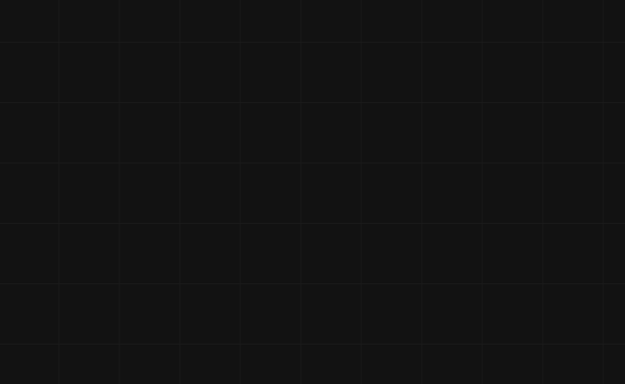

<p align="center">
    <a href="#">
        
    </a>
</p>
<h1 align="center">
    Graphite.js
</h1>
<p align="center" dir="auto">
    Graphite.js is an open-source JavaScript library for building and managing flexible, performant, and clean node-based systems on the web.
</p>

<a href="./docs/index.html"><h3 align="center">DOCUMENTATION</h3></a>

<!--Badges-->
<p align="center">
    </img>
</p>

## Features

- Fully fledged node graph engine, renderer, handler and evaluator
- Customizable and flexible node system for creating custom nodes
- Theme settings and loader
- Easy integration into projects

</img>

## Pre-built Nodes
- Math nodes
- Logic nodes
- IO nodes (debug)
- PBR Material nodes (WIP)

## Basic Usage
```javascript
// create wrapper
const wrapper = new NodeWrapper();

// link canvas to it
wrapper.LinkCanvas(document.getElementById('graphite-canvas'));

// register the node sets (the nodes the app will use)
NodeRegistry.RegisterSet(STANDARD_NODE_SET);

// update function for every frame (simple evaluation)
function update()
{
    requestAnimationFrame(update);
    
    // update and evaluate all nodes
    wrapper.UpdateNodes();
}
// run update function
update();
```

## Contribution
We welcome contributions from developers interested in helping us build Graphite.js. If you'd like to contribute, please fork this repository and submit a pull request.